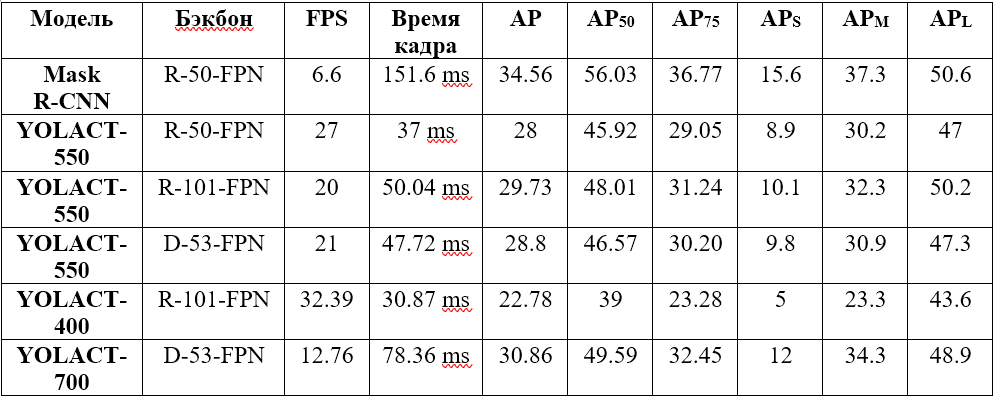
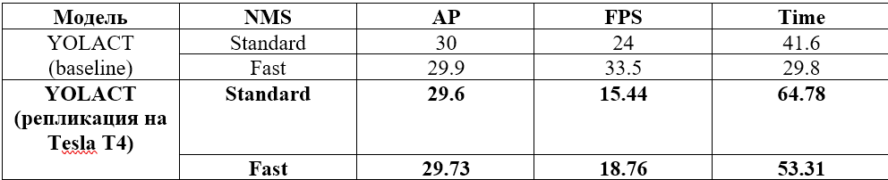
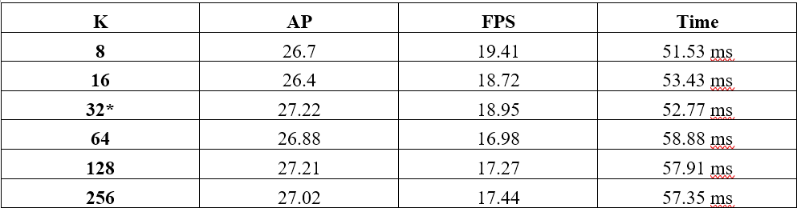
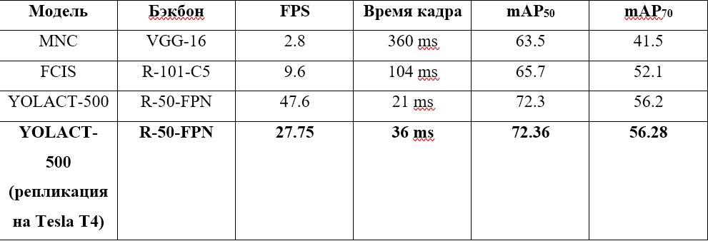
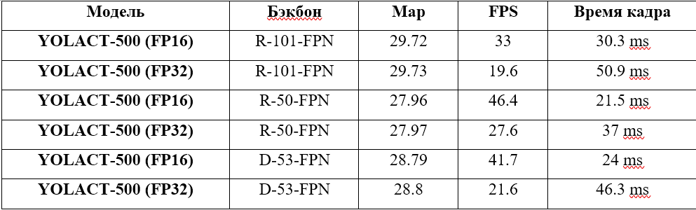
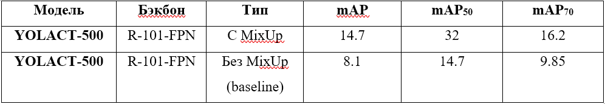

# YOLACT: воспроизведение экспериментов и улучшения (FP16 + MixUp)

Данный репозиторий содержит **исправления** (патчи) и **улучшения** для оригинального репозитория dbolya [YOLACT](https://github.com/dbolya/yolact), позволяющие:
- воспроизвести эксперименты из статьи YOLACT (ICCV 2019) на современном оборудовании через блокнот Google Colab на GPU Tesla T4;
- запустить инференс со **смешанной точностью (FP16)** для ускорения в 1.7–1.9 раза без потери качества;
- применить **аугментацию MixUp** при дообучении модели для повышения устойчивости к переобучению.

Работа выполнена в рамках учебной практики «Большие данные и интеллектуальные системы» (ИГУ, 2026).

---

## Содержание

1. [Основные результаты](#основные-результаты)
2. [Требования к окружению](#требования-к-окружению)
3. [Установка и применение исправлений](#установка-и-применение-исправлений)
4. [Воспроизведение оригинальных экспериментов](#воспроизведение-оригинальных-экспериментов)
5. [Улучшения](#улучшения)
   - [Смешанная точность (FP16)](#смешанная-точность-fp16)
   - [Аугментация MixUp](#аугментация-mixup)

---

## Основные результаты

- **Воспроизведение** базовых экспериментов YOLACT на COCO и Pascal SBD подтвердило заявленную скорость (до 33 FPS) и точность (AP ~29.7). Расхождения с оригиналом обусловлены использованием GPU Tesla T4 вместо Titan Xp.
- **FP16-инференс** дал прирост FPS на **70–93%** (например, R-101-FPN: 19.6 → 33 FPS) при падении mAP менее 0.01.
- **MixUp** при дообучении на 2500 итерациях показал регуляризующий эффект: mAP вырос с 8.1 до 14.7 по сравнению с baseline. Для полного эффекта требуется >20000 итераций – это перспектива дальнейшей работы.

Все численные результаты сведены в таблицы в разделе [Результаты](#результаты) (см. файлы `results/`).

---

## Требования к окружению

- **Python 3.8+**
- **PyTorch 1.9+** (рекомендуется 2.0.1)
- **CUDA 11.7+** (для работы FP16 желательно наличие тензорных ядер)
- Остальные зависимости – в `requirements.txt`

---

## Установка и применение исправлений

Поскольку оригинальный репозиторий содержит legacy-код и несовместим с новыми версиями PyTorch/CUDA, был подготовлен патч, который исправляет следующие ошибки:

- синтаксис в `cython_nms.pyx` для Cython ≥0.29;
- несовместимые импорты и вызовы в `eval.py`, `train.py`;
- добавлена детерминированность (фиксация seed).
- дополнительные патчи для воспроизведения эксперимента на кол-во prototype-масок (k)

Патчи были разделены на папки `main_fixes` и `protoMask_fixes`:
- `Main_fixes` содержит исправленные компоненты для стандартного запуска обучения и инференса моделей как в оригинальной YOLACT
- `protoMask_fixes` содержит компоненты и модифицированный train.py для возможности переноса обучения на разных кол-вах prototype-масок, которые можно изменить
через флаг `--k`
**Примечание:** В каждом из "патчей" имеется собственный настроенный `config.py` с готовыми параметрами и которые можно при желании изменить. Для применения патчей достаточно заменить оригинальные компоненты на те, что предложены в папке `fixes` любым удобным способом, но при этом сохранять бэкапы
в случае отката изменений до первоначального состояния репозитория.
---

## Воспроизведение оригинальных экспериментов
Для воспроизведения экспериментов необходимо использовать готовый блокнот данного проекта и применить вышеупомянутые патчи для запуска конкретных блоков.

Для скачивания датасетов как MS COCO 2017 советую использовать wget внутри блокнота и распаковывать прямиком в папку `data`. Важно! Чтобы структура пути
к датасету были следующие:
- Для train-составляющей датасета: `.../data/train2017/`
- Для val-составляющей: `.../data/val2017/`
К датасету также соответственно необходимо скачать аннотации, данный шаг предусмотрен в Colab-блокноте проекта.

Для Pascal SBD датасета шаги те же, но необходимо скачать сконвертированные под `.json` файлы аннотаций по следующей [ссылке](https://drive.google.com/open?id=1ExrRSPVctHW8Nxrn0SofU1lVhK5Wn0_S)

Для обучения моделей YOLACT нужно предварительно скачать предобученные веса моделей рода imagenet и переместить в `./weights`.
Это можно сделать как через команды, имеющийся в блокноте, либо по ссылкам внизу:
- Для Resnet101, скачиваем `resnet101_reducedfc.pth` [здесь](https://huggingface.co/dbolya/yolact-initial-weights/resolve/main/resnet101_reducedfc.pth?download=true).
- Для Resnet50, скачиваем `resnet50-19c8e357.pth` from [здесь](https://huggingface.co/dbolya/yolact-initial-weights/resolve/main/resnet50-19c8e357.pth?download=true).
- Для Darknet53, скачиваем `darknet53.pth` from [здесь](https://huggingface.co/dbolya/yolact-initial-weights/resolve/main/darknet53.pth?download=true).

Шаги по воспроизведению экспериментов:
- Для воспроизведения первых экспериментов рекомендуется заменить оригинальные компоненты на те, что находятся в `./fixes/main_fixes` 
- Для воспроизведения экспериментов для кол-ва масок рекомендуется заменить оригинальные компоненты на те, что находятся в `./fixes/protoMask_fixes`
- Основные инструкции по базовому использованию YOLACT и запуску всех необходимых компонентов для обучения или инференса можно найти в оригинальном
[репозитории](https://github.com/dbolya/yolact) в описании, либо следовать шагам, описанные в блокноте, для работы в Google Colab.

---
## Улучшения

В данном репозитории имеются улучшения, содержащиеся в папке `improvements`, среди улучшений:

### **Смешанная точность fp16**
Работает на видеокартах с тензорными ядрами. Предназначен для повышения метрик производительности инференса моделей, работающая через обретку
`torch.cuda.amp.autocast()`. Включается через параметр `--fp16` перед запуском `eval.py`. Содержится в `./improvements/FP16_integration`

### **Аугментация MixUp**

Аугментация для повышение обобщающей способности модели и предотвращения переобучения. Работает по принципу создания виртуальных обучающих примеров путём комбинации двух случайных изображений и соответствующих им меток. Ключевые модифицированные компоненты такие как `mixup.py`, `coco.py` и другие находятся в `./improvements/MixUp` в соответствующих им папках.

## Результаты

### Воспроизведение эксперимента из статьи №1 - Рисунок 1 "Сравнение качества масок между YOLACT, FCIS и Mask R-CNN"

### Воспроизведение эксперимента из статьи №2 - Таблица 1 "Воспроизведение таблицы 1 – Результаты моделей MS COCO"

### Воспроизведение эксперимента из статьи №3 - Таблица 2 с частями а и b
- Таблица 2(а) "Сравнение метрики YOLACT с оригинальной статьи и репликации при Fast и Traditional NMS"

- Таблица 2(b) "Результаты воспроизведения эксперимента по влиянию параметра k на показатели YOLACT"

### Воспроизведение эксперимента из статьи №4 - Таблица 3 "Сравнение воспроизведенного результата с оригинальным результатом моделей на Pascal 2012 SBD датасете"

### Эксперимент с интегрированным улучшением №1 - Таблица 1 "Сравнение моделей, поддерживающую половинную точность (FP16) с оригинальными (FP32)"

### Эксперимент с интегрированным улучшением №2 - Таблица 2 "Сравнение результатов дообучения модели YOLACT с MixUp и baseline"

---

